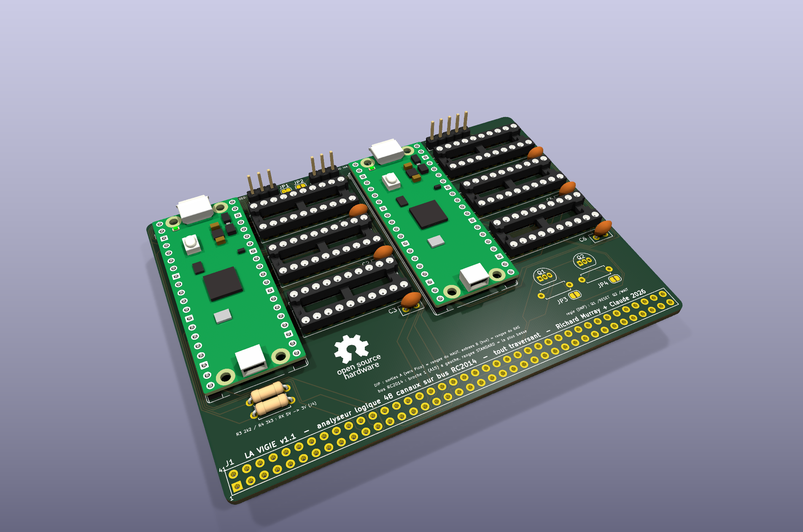
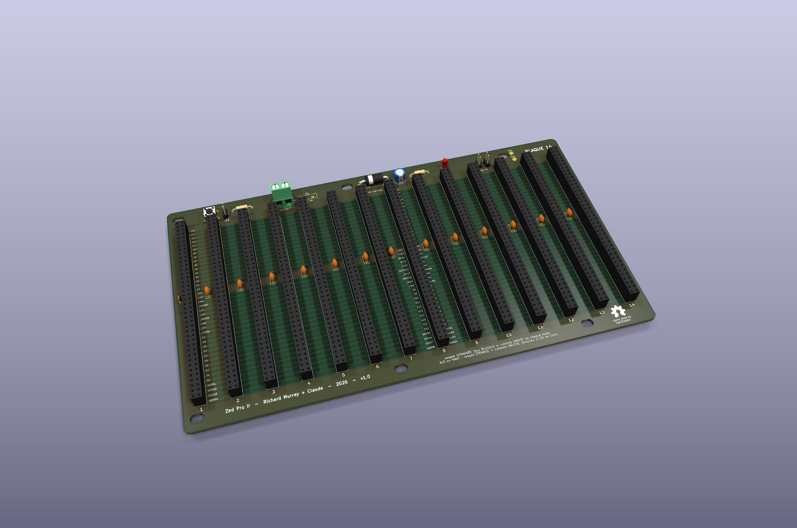

# Zorton Utilities — the Zorton workshop

*Version française : [LISEZMOI.md](LISEZMOI.md)*

```
                 __/\__
                 \    /      *  EPROUVE ZORTON  *
                 /_  _\      the star is only
                   \/        given on merit
```

A retro workshop in Québec: Z80, real through-hole silicon,
RC2014/RomWBW machines you can look in the eye — and one simple rule:
**nothing is claimed without a bench, nothing is given without merit.**

This repository is the workshop's **showcase**: published tools,
guides and certificates. Everything here was proven on real hardware
before being shown.

## Test tools (the Zorton Assurance line)

Every card that crosses our bench leaves with its **companion**: a
CP/M program that advises you BEFORE installation, proves the card
AFTER, and writes its certificate.

| Tool | Card | What it does |
|---|---|---|
| [MG014.COM](zorton/publication-mg014/) | MG014 (82C55 parallel interface, DB25) | address advisor that DRAWS the DIP-switch block, full certifier (latches, BSR, LED chase), printable certificate |

The tools speak French — that's the workshop's native language — but a
verdict like `0 faute` (zero faults) reads the same everywhere, and
each kit ships with an English README.

## Workshop guides

| Guide | What it covers |
|---|---|
| [Reconditioning a 3½" floppy drive](guides/GUIDE-LECTEURS-DISQUETTE-CLUB.pdf) (French) | the golden rule, drive anatomy, recommended lubricants, a 7-step recipe, troubleshooting |
| [CP/M commands](guides/GUIDE-COMMANDES-CPM-CLUB.pdf) (French) | from “I only know DIR” to the full picture: the 6 built-ins and their traps, the utilities, a PIP cookbook, CP/M 3, Z-System, RomWBW |
| [CP437, Latin-1 and ANSI color](guides/GUIDE-CP437-CARACTERES-CLUB.pdf) (French) | writing accents and drawing frames in Z80 without losing a byte: the two worlds, full tables, the window toolbox, the accent bridge |

## Coming up

The **Zorton Card (ZC)** family is growing at the workshop — RC2014
cards *born certified*: designed testable, shipped with their
companion tool and their certificate. Renders and kits will appear
here once the bench has spoken.

The two eldest are already on the table — first renders:

**ZC001 — La Vigie**: a 48-channel logic analyzer right on the RC2014
bus (2 Raspberry Pi Picos + 6 buffers), all through-hole.



**ZC002 — La Plaque 14**: a 14-slot extended-bus backplane (2×40),
with supervised power.




## License

See [LICENCE.md](LICENCE.md) — free for personal use, commercial by
arrangement.

---
*Richard Murray + Claude — the Zorton workshop: we build quietly, not
quickly.*
